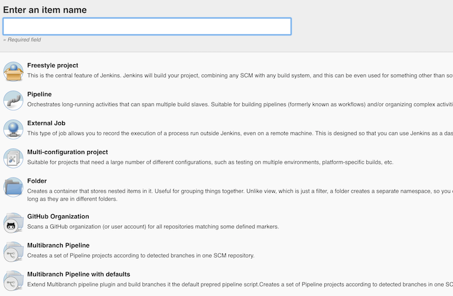

class: center, middle

# Jenkins Pipelines

#### Automating the Automation

 

.left[
David Rubin]
.left[
[<i class="fa fa-slack" aria-hidden="true"></i> zatech](http://zatech.co.za)]
.left[
[<i class="fa fa-twitter" aria-hidden="true"> drubin87</i>](http://twitter.com/drubin87)]
.left[
[<i class="fa fa-github" aria-hidden="true"> drubin</i>](http://github.com/drubin)]
.left[
[<i class="fa fa-linkedin" aria-hidden="true"> David Rubin</i>](https://www.linkedin.com/in/davidrub)]


---
# Overview 

CI / CD What is it all about 

* Testing 
* Building 
* Deployment / Release management
* Adhoc

???
What tool does every one use?
What do they use it for? Testing/Deployment/Adhoc tasks
- Jenkins 
- Travis 
- Circle / Snap / * 
- Team City / Bamboo / * 

---

### Jenkins 1.0


???
- Jenkins is OLD 
- Been working with jenkins since 2009
- My first expereince was with a 3 node cluster, Windows, OSX, Linux with 8 hour build jobs

---

# Automation was the problem 

* Not versioned 
* Impossible to review 
* Build jobs out of sync with code 
* Dependant jobs configured in different places
* Complex Workflows impossible to build, duplication all over
* Lots of plugins try to hack solutions

???
- Horor stories about loosing automation 
- Unable to deploy / stand still 
- CI should NEVER be a bottle neck

---

## Meet Blue Ocean


???
- Shiny, built with pipelines / git workflow in mind
- Visual Graph dependancy 
- Cloudbees + huge funding 

---

Defining Work flows



???
- Feestyle (legacy)
- Single pipeline job, embeded code
- SCM single 
- SCM Multi
- SCM Originsation 

---

## Jenkinsfile 
```groovy 
// load pipeline functions
@Library('github.com/drubin/jenkins-pipeline@master')
def pipeline = new io.Pipeline()

ansiColor('xterm') {
  node {
    // Set github status that the images could be built successfully
    step([$class: 'GitHubSetCommitStatusBuilder'])
    checkout scm
    stage('install'){
      downloadTerraform()
      env.PATH = "${env.PATH}:${env.WORKSPACE}"
    }
}
```

* Groovy
* Access to proper programming language with closures/loops/threads/* 
* Shared Java ecosystem without the bloat 
* **Shared libs**

???
- Load from shared code
- Automatic config based on github org
- REAL Loops / Maps

---
Complex Workflows


???
- Fan in / Fan out 
- Threaded parts/ blocking 
- User input 
- Multi machine single job 

---

# Script Generator
[http://localhost:8080/job/drubin/pipeline-syntax/](http://localhost:8080/job/drubin/pipeline-syntax/)


???
- They have a script generator
- Takes into account YOUR jenkins setup/env
- Can be used to check syntax/docs (based on your jenkins version/plugins)

---
## User input 

```groovy
// Do not allocate a node as this is a blocking request and should be run on light weight executor 
def userInputEnv = null
//Out side node block to be none blcking
timeout(time: 1, unit: 'HOURS') {
  userInput = input message: 'Are you sure you would like to apply these to production?', 
    parameters: [string(defaultValue: '', description: 'Your name', name: 'name')]
}
```

## Stashing 

```groovy
  // Save plan output for future so they can be compared
  archiveArtifacts 'plan.plan'
  // store the plan file to be used later on potentially different node
  stash includes: 'plan.plan', name: 'plans'
  .....
  // restore saved plan file from potentially different node
  unstash name: 'plans'
```

## Pullrequests 

```groovy
// we don't release or ask for user input on pull requests
pullRequest = env.BRANCH_NAME != 'master'
....
if(pullRequest){
  return
}
```
???
- Node blocks
- Fly weight exectutors 
- Timeouts
- Limits (auth)
- Stashing / Applying later on different nodes
- Dealing with pull requests/branches i.e deploy on master
---

# Credential Manager


* Removes secure credentails from build scripts
* Single place to update when they change/cycle 
* DRY principles applied to `security`

```groovy
withCredentials([
      usernamePassword(credentialsId: 'aws-keys', 
      passwordVariable: 'AWS_SECRET_ACCESS_KEY', usernameVariable: 'AWS_ACCESS_KEY_ID')
]) {
  sh """
    terraform remote config -backend=S3 -backend-config="bucket=david-jenkins-state" -backend-config="key=state.tfstate" -backend-config="region=eu-west-1"
    terraform plan -out plan.plan
  """
}
```
???
- Cheap Vault 
- Encrypted using jenkins shared key 
- Can add fine grained access/limits 
- Shared across multiple machines / jobs 
---

## Locking


```groovy
stage('Build') {
  // The first milestone step starts tracking concurrent build order
  milestone()
  node {
    echo "Building"
  }
}

// This locked resource contains both Test stages as a single concurrency Unit.
// Only 1 concurrent build is allowed to utilize the test resources at a time.
// Newer builds are pulled off the queue first. When a build reaches the
// milestone at the end of the lock, all jobs started prior to the current
// build that are still waiting for the lock will be aborted
lock(resource: 'myResource', inversePrecedence: true){
  node('test') {
    stage('Unit Tests') {
      echo "Unit Tests"
    }
    stage('System Tests') {
      echo "System Tests"
    }
  }
  milestone()
}

// The Deploy stage does not limit concurrency but requires manual input
// from a user. Several builds might reach this step waiting for input.
// When a user promotes a specific build all preceding builds are aborted,
// ensuring that the latest code is always deployed.
stage('Deploy') {
  input "Deploy?"
  milestone()
  node {
    echo "Deploying"
  }
}
```
???
- If 2 users commit at same time 2 jobs are triggered
- Paralel is great; what if you have a single DB/environment? 
- Slow jobs queing up the system

---
# Advice 

* Jenkins files should define workflows not every CLI command
* Leverage exsisting build tools such as bash/make/* and wrap the flow in Jenkinsfile

** Debugging**
* Via PR's
* Local Jenkinfile's docker image
* via unit tested shared libaries
* Manually creating a pipeline jobs
* Slower iteration time

---
class: center, middle
#Live Demo 
Lets hope it works

.... .... .... 

???
- Jenkins 
- Terraform website 
- Workflow

---

# Useful plugins 

* EC2 Slave plugin 
* AnsiColor 
* Timestamper
* Locks milestone 
* Blue Ocean 
* Github / Gitlab / Bitbucket 
* Google Login Plugin  / Github Login Plugin 
* Mask Passwords plugin
* Shelve Project
* Slack Notification plugin 

---

# Links

* Great Summary https://jenkins.io/projects/blueocean/ 
* plugin examples info https://wilsonmar.github.io/jenkins2-pipeline/
* fabric8io libs https://github.com/fabric8io/jenkins-pipeline-library
* another https://github.com/funkwerk/jenkins-workflow
* Locks and milestone https://jenkins.io/blog/2016/10/16/stage-lock-milestone/
* Examples https://jenkins.io/doc/pipeline/examples/
* Real world example https://github.com/lachie83/croc-hunter
* Reference https://jenkins.io/doc/pipeline/steps/

** Presenation ** 
* Pipeline Demo https://github.com/drubin/jenkins-terraform-demo
* Slide source https://github.com/drubin/presentations/ 
* Slides https://drubin.github.io/presentations/ 


 --- 
.center[**Thanks**]